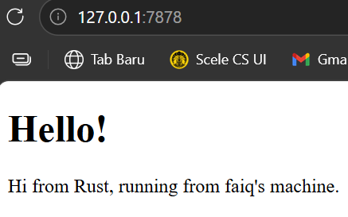
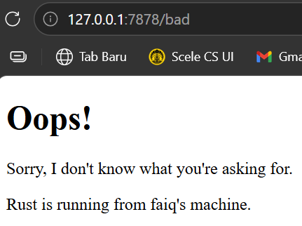

# Reflection Module 6

## Commit 1 Reflection Notes

Pada milestone ini, server sudah bisa menerima koneksi TCP dan membaca request dari browser. Fungsi `handle_connection` menggunakan `BufReader` untuk membaca request HTTP baris per baris hingga menemukan baris kosong yang menandakan akhir dari HTTP header. Setiap kali browser mengakses server, ia mengirimkan informasi seperti method (GET), path, versi HTTP, dan berbagai header lainnya. Yang menarik, browser kadang mengirim beberapa koneksi sekaligus sehingga "Connection established!" bisa muncul lebih dari sekali. Dari sini terlihat bagaimana komunikasi antara browser dan server bekerja di level yang paling dasar.

## Commit 2 Reflection Notes

Pada milestone ini, server sudah bisa mengirimkan halaman HTML yang bisa dirender oleh browser. HTTP response memiliki struktur tertentu yang diawali dengan status line seperti `HTTP/1.1 200 OK`, diikuti header seperti `Content-Length`, lalu baris kosong, baru kemudian isi kontennya. `Content-Length` penting agar browser tahu berapa byte yang harus dibaca. Fungsi `fs::read_to_string` digunakan untuk membaca isi file `hello.html` menjadi String yang kemudian dikirim sebagai response. Pada dasarnya web server hanyalah program yang menerima teks request dan membalas dengan teks response mengikuti aturan protokol HTTP.

**Screenshot**

## Commit 3 Reflection Notes

Pada milestone ini, server sudah bisa membedakan request yang valid dan tidak valid. Server membaca baris pertama HTTP request untuk mengetahui URL yang diminta, lalu memutuskan file mana yang harus dikirim sebagai response. Refactoring dilakukan dengan memisahkan bagian penentuan status_line dan filename ke dalam blok if/else tersendiri, sehingga bagian pengiriman response (membaca file, menghitung panjang, menulis ke stream) hanya ditulis sekali dan tidak duplikat. Tanpa refactoring ini, setiap kondisi harus menulis ulang seluruh logika pengiriman response yang membuat kode lebih panjang dan susah dimaintain. Dengan pemisahan ini kode menjadi lebih bersih, lebih mudah dibaca, dan jika ada perubahan pada cara pengiriman response cukup diubah di satu tempat saja.

**Screenshot**

## Commit 4 Reflection Notes

Pada milestone ini, ditambahkan route `/sleep` yang sengaja ditunda 10 detik untuk mensimulasikan request yang lambat. Ketika membuka dua tab browser, satu mengakses `/sleep` dan satu mengakses `/`, tab kedua ikut menunggu 10 detik meskipun seharusnya langsung selesai. Hal ini terjadi karena server berjalan secara single-threaded, di mana `handle_connection` dipanggil langsung di main thread tanpa `thread::spawn` sehingga setiap request harus antri satu per satu. Ini adalah demonstrasi nyata kelemahan single-threaded server, bayangkan jika ada ratusan user mengakses bersamaan. Dari sini terlihat jelas mengapa concurrency sangat penting untuk membuat server yang responsif.